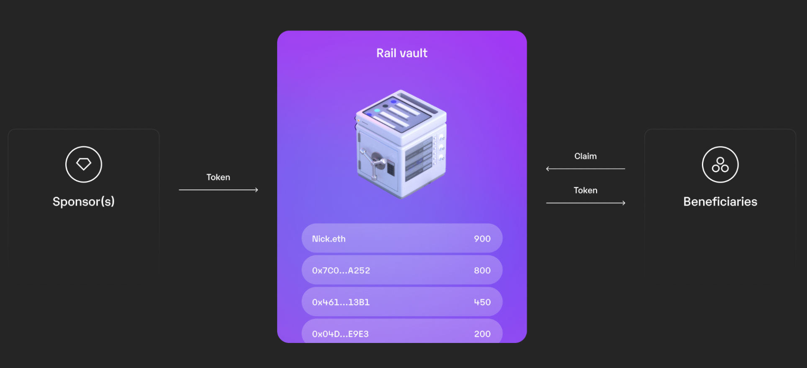

# 1️⃣ Intro to Rail

:::info in a nutshell

- Rail vaults enable recurring group payments and revenue sharing among beneficiaries through smart contracts on EVM chains like Polygon.
- Beneficiaries join a vault and receive a share of deposits based on a weighting variable, determining their eligibility for tokens relative to others.
- Interface the vault contracts with our SDK

:::

### Vault

Rail vaults are created through the Rail vault factory contract and deployed on general-purpose EVM chains such as Polygon. They allow operators such as Digital Infrastructure Inc. to make recurring group payments (deposits) to sets of beneficiaries, for example, baseline issuance of a reward token.

### Beneficiaries and Deposits

Beneficiaries join a vault and become eligible to receive a share of the incoming deposits. The vault contract tracks the deposits. A weighting variable can determine how many tokens each beneficiary is eligible for in relation to others.

### Protocol fee

Rail charges a protocol fee, which is a percentage of every incoming transaction, and gets determined by the protocol fee oracle smart contract, owned by Rail. The protocol beneficiary address receives the protocol fee.

### Rail SDK

Finally, Rail SDK is an npm package that helps integrate the vault contracts into a node environment. Overall, Rail is a tool that facilitates the pooling of tokens and revenue sharing among multiple parties through the use of smart contracts.

### How it works

Sponsors deposit tokens in the smart contract (vault). The vault allocates the tokens to the beneficiaries. The beneficiaries can then claim the tokens associated with their address.

The Rail vault keeps track of who is owed what; in other words– the smart contracts are stateful. The vaults convert deposited tokens into vault shares mapped to a set of beneficiaries, either equally or proportional to each vault beneficiary’s relative weighting. There is no limit to the number of beneficiaries or weighting combinations.

:::info Example for integration

1. The vault is created,
2. 10 beneficiaries join the vault,
3. 100 tokens are deposited into the vault,
4. 5 of the 10 beneficiaries become inactive (failed to meet the reward criteria),
5. 50 additional tokens get deposited into the vault.

The vault now has 5 beneficiaries with 20 claimable tokens each and 5 beneficiaries with 10 claimable tokens because the 5 beneficiaries became inactive before the sponsor had deposited the 50 additional tokens.

:::
